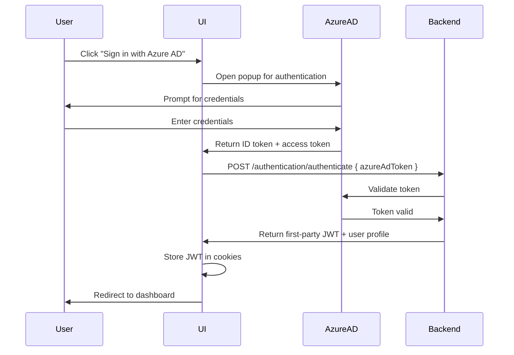

# Azure AD Authentication Setup Guide

This guide explains how to configure Azure AD Single Sign-On (SSO) for the Task Management UI.

## Overview

The UI supports two authentication methods:
1. **Manual Token Entry**: Users can paste an Azure AD token directly (always available)
2. **Azure AD SSO** (Optional): Users can sign in via Azure AD popup flow

Azure AD SSO is **optional**. If not configured, users will only see the manual token entry option.

---

## Azure AD Configuration

### Prerequisites

- An Azure AD tenant
- An App Registration in Azure Portal for the backend API
- An App Registration in Azure Portal for the frontend UI (can be the same or separate)
- Admin access to Azure Portal

### Step 1: Create/Configure App Registration

1. Go to [Azure Portal](https://portal.azure.com)
2. Navigate to **Azure Active Directory** > **App registrations**
3. Either create a new app or use an existing one

#### For New App Registration:
- Click **New registration**
- Name: `Task Management UI` (or your preferred name)
- Supported account types: Select based on your requirements (Single tenant recommended)
- Redirect URI: 
  - Type: `Single-page application (SPA)`
  - URI: `http://localhost:3000` (for development)
  - Add production URL when deploying (e.g., `https://yourdomain.com`)

### Step 2: Configure Authentication

1. In your App Registration, go to **Authentication**
2. Under **Platform configurations** > **Single-page application**:
   - Add redirect URIs:
     - `http://localhost:3000` (development)
     - Your production URL (when deploying)
3. Under **Implicit grant and hybrid flows**, ensure:
   - ✅ **ID tokens** (used for user authentication)
   - ✅ **Access tokens** (used for API authorization)
4. Under **Advanced settings**:
   - Allow public client flows: **No** (for SPA)
5. Click **Save**

### Step 3: Configure API Permissions

1. Go to **API permissions**
2. Click **Add a permission**
3. Select **My APIs** (if your backend is registered) or **Microsoft Graph**
4. Add the following permissions:
   - `openid` (delegated)
   - `profile` (delegated)
   - `email` (delegated)
   - Your backend API scope (e.g., `api://your-backend-client-id/.default`)
5. Click **Grant admin consent** if required by your organization

### Step 4: Note Down Required Values

From the **Overview** page of your App Registration, copy:
- **Application (client) ID** → This is your `NEXT_PUBLIC_AZURE_AD_CLIENT_ID`
- **Directory (tenant) ID** → This is your `NEXT_PUBLIC_AZURE_AD_TENANT_ID`

---

## Environment Configuration

### Development (.env.local)

Create or update `web/.env.local`:

```bash
# API Configuration
NEXT_PUBLIC_API_BASE_URL=http://localhost:5010
NEXT_PUBLIC_APP_NAME=Task Management Console

# Azure AD Configuration
NEXT_PUBLIC_AZURE_AD_CLIENT_ID=12345678-1234-1234-1234-123456789abc
NEXT_PUBLIC_AZURE_AD_TENANT_ID=87654321-4321-4321-4321-210987654321
NEXT_PUBLIC_AZURE_AD_REDIRECT_URI=http://localhost:3000
NEXT_PUBLIC_AZURE_AD_SCOPES=api://your-backend-api-client-id/.default,openid,profile,email
```

### Production

Set these environment variables in your hosting platform (Vercel, Azure, AWS, etc.):

```bash
NEXT_PUBLIC_API_BASE_URL=https://api.yourdomain.com
NEXT_PUBLIC_APP_NAME=Task Management Console
NEXT_PUBLIC_AZURE_AD_CLIENT_ID=your-production-client-id
NEXT_PUBLIC_AZURE_AD_TENANT_ID=your-tenant-id
NEXT_PUBLIC_AZURE_AD_REDIRECT_URI=https://yourdomain.com
NEXT_PUBLIC_AZURE_AD_SCOPES=api://your-backend-api-client-id/.default,openid,profile,email
```

---

## Configuration Details

### Required Environment Variables

| Variable | Required | Description | Example |
|----------|----------|-------------|---------|
| `NEXT_PUBLIC_AZURE_AD_CLIENT_ID` | Yes* | Application (client) ID from Azure Portal | `12345678-1234-1234-1234-123456789abc` |
| `NEXT_PUBLIC_AZURE_AD_TENANT_ID` | Yes* | Directory (tenant) ID from Azure Portal | `87654321-4321-4321-4321-210987654321` |
| `NEXT_PUBLIC_AZURE_AD_REDIRECT_URI` | No | Redirect URI after authentication | `http://localhost:3000` |
| `NEXT_PUBLIC_AZURE_AD_SCOPES` | No | Comma-separated list of scopes | `api://backend/.default,openid,profile,email` |

\* Required only if you want to enable Azure AD SSO. If not provided, only manual token entry will work.

### Default Values

- **Redirect URI**: If not provided, defaults to the current window origin
- **Scopes**: If not provided, defaults to `api://{clientId}/.default`

---

## How It Works

### Authentication Flow

1. User clicks **Continue with Azure AD** on the sign-in page
2. A popup window opens with Azure AD login
3. User authenticates with their Azure AD credentials
4. Azure AD returns an ID token and access token
5. The UI sends the ID token to `/api/auth/login`
6. Backend validates the token and returns a first-party JWT
7. UI stores the JWT and redirects to the dashboard

### Token Exchange



---

## Files Involved

### 1. Environment Configuration (`src/core/config/env.ts`)

Validates and exposes Azure AD configuration:

```typescript
export function getEnvConfig(): EnvConfig {
  // Reads and validates all NEXT_PUBLIC_AZURE_AD_* variables
  // Returns typed config object with azureAd property
}
```

### 2. Azure AD Hook (`src/features/auth/hooks/useAzureAdLogin.ts`)

Manages MSAL (Microsoft Authentication Library) integration:

```typescript
export function useAzureAdLogin() {
  return {
    isConfigured: boolean,  // true if Azure AD is configured
    isLoading: boolean,     // true during authentication
    login: () => Promise<AuthenticationResult>  // triggers popup
  };
}
```

### 3. Sign-In Form (`src/features/auth/components/SignInForm.tsx`)

Renders both authentication options:
- Manual token entry (always available)
- Azure AD SSO button (only if configured)

---

## Testing

### Test Azure AD Configuration

1. Start the development server:
   ```bash
   cd web
   npm run dev
   ```

2. Navigate to `http://localhost:3000/en/sign-in`

3. Check the console for Azure AD config:
   ```
   Azure AD config: {
     clientId: "12345678-...",
     tenantId: "87654321-...",
     redirectUri: "http://localhost:3000",
     scopes: ["api://...", "openid", "profile", "email"]
   }
   ```

4. Click **Continue with Azure AD**

5. A popup should open with Azure AD login

### Test Without Azure AD

1. Comment out or remove Azure AD variables from `.env.local`

2. Restart the development server

3. The **Continue with Azure AD** button should be disabled with a message:
   > "Azure AD is not currently available"

---

## Troubleshooting

### Issue: "Azure AD is not currently available"

**Cause**: Azure AD environment variables are missing or invalid.

**Solution**:
1. Verify `NEXT_PUBLIC_AZURE_AD_CLIENT_ID` and `NEXT_PUBLIC_AZURE_AD_TENANT_ID` are set in `.env.local`
2. Restart the development server after changing environment variables
3. Check the browser console for config errors

### Issue: Popup blocked

**Cause**: Browser is blocking the popup window.

**Solution**:
1. Allow popups for `localhost:3000` in browser settings
2. Or use redirect flow instead (requires code changes)

### Issue: "AADSTS50011: Redirect URI mismatch"

**Cause**: The redirect URI in your code doesn't match what's registered in Azure Portal.

**Solution**:
1. Go to Azure Portal > App Registration > Authentication
2. Add `http://localhost:3000` (development) as a redirect URI
3. Add production URL when deploying
4. Ensure `NEXT_PUBLIC_AZURE_AD_REDIRECT_URI` matches exactly

### Issue: "Invalid scope"

**Cause**: The scopes you're requesting aren't configured in Azure Portal.

**Solution**:
1. Go to Azure Portal > App Registration > API permissions
2. Add missing permissions (openid, profile, email, your backend API scope)
3. Click **Grant admin consent** if required

### Issue: Token validation fails on backend

**Cause**: Backend cannot validate the Azure AD token.

**Solution**:
1. Ensure backend is configured with the same tenant ID
2. Verify backend API scope matches what's in `NEXT_PUBLIC_AZURE_AD_SCOPES`
3. Check backend logs for validation errors

---

## Security Best Practices

1. **Never commit `.env.local`** to version control (already in `.gitignore`)
2. **Rotate secrets regularly**: Generate new client secrets periodically
3. **Use HTTPS in production**: Azure AD requires HTTPS for production redirect URIs
4. **Restrict redirect URIs**: Only add necessary URIs in Azure Portal
5. **Request minimum scopes**: Only request the permissions you need
6. **Enable MFA**: Require multi-factor authentication for users in Azure AD
7. **Monitor sign-ins**: Use Azure AD sign-in logs to detect anomalies

---

## Additional Resources

- [Microsoft Authentication Library (MSAL) Documentation](https://docs.microsoft.com/en-us/azure/active-directory/develop/msal-overview)
- [Azure AD App Registration](https://docs.microsoft.com/en-us/azure/active-directory/develop/quickstart-register-app)
- [Single-page application: Sign-in and Sign-out](https://docs.microsoft.com/en-us/azure/active-directory/develop/scenario-spa-sign-in)
- [Microsoft Graph Permissions](https://docs.microsoft.com/en-us/graph/permissions-reference)

---

## Support

If you encounter issues:
1. Check the browser console for errors
2. Review Azure AD sign-in logs in Azure Portal
3. Verify backend API logs for token validation errors
4. Ensure all redirect URIs match exactly (including trailing slashes)


